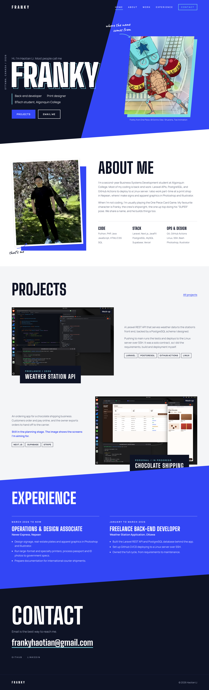

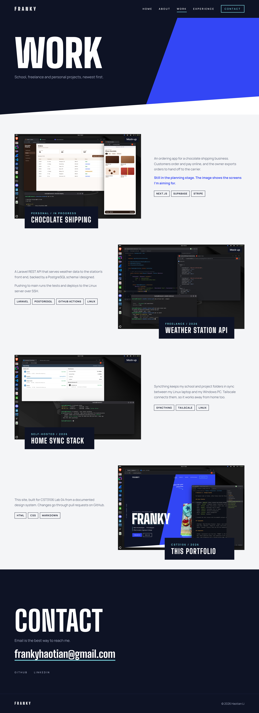
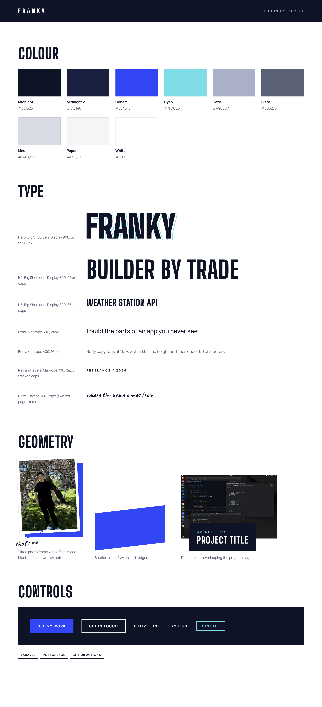

# Haotian Li – Design System

My English name is Franky, after Franky from One Piece (I play the One Piece Card Game). The portfolio is built around that name: a dark hero with "FRANKY" in big letters, then lighter sections for the rest.

## Color Palette

- Midnight: `#0E1325` (hero, contact and footer background, main text)
- Cobalt: `#3346F5` (diagonal shapes, Experience section, buttons, links)
- Cyan: `#7FDCE6` (taken from Franky's robot arms; outlines and highlights on dark backgrounds only)
- Haze: `#A9B0C7` (secondary text on dark)
- Slate: `#5B6275` (secondary text on light)
- Paper: `#F4F5F7` (Projects background)
- White: `#FFFFFF` (About background)
- Line: `#D9DCE4` (borders)

I checked the text colours with the WebAIM contrast checker. They all pass AA.

## Typography

- Headings: "Big Shoulders Display", Impact, sans-serif (tall and narrow, so the name can be huge)
- Body text: "Manrope", "Segoe UI", Arial, sans-serif
- Notes: "Caveat", cursive (only for the two handwritten notes)

## Components

- Header: transparent over the hero, "FRANKY" on the left, links on the right. Contact is an outlined button.
- Nav: white uppercase links, cyan underline on the current page.
- Hero: dark background with a slanted bottom edge. My name on the left, Franky's "SUPER" pose on the right in a tilted frame.
- About: my photo on the left (tilted like a printed photo), text and skills on the right.
- Project row: big image on one side, description on the other. A dark box with the project name overlaps the image. Rows switch sides.
- Experience: blue section slanted at the top and bottom, two jobs side by side.
- Contact: dark section with my email as a big link.
- Footer: dark, name on the left, copyright on the right.

## Layout

- Content: CSS Grid for the About section and project rows, Flexbox for the header, hero and footer.
- Nav list: horizontal on desktop, wraps under the logo on phones.
- Under 900px: everything stacks into one column and Franky moves below my name.
- Under 640px: smaller headings and a steeper slant.
- Under 1280px: the vertical "Ottawa, Canada / 2026" text is hidden because it ran into my name on my 13" laptop.

## Mock-ups

Home page (desktop)

Home page (phone)

Projects page

Style guide

The project images on the site are mock-ups for now (they say so on the image). I'll replace them with real screenshots from my laptop.

## Credits

- Franky image: One Piece © Eiichiro Oda / Shueisha, Toei Animation
- Fonts: [Google Fonts](https://fonts.google.com/)
- [W3Schools CSS Colors](https://www.w3schools.com/css/css_colors.asp)
- [W3Schools CSS Fonts](https://www.w3schools.com/css/css_font.asp)
- [WebAIM Contrast Checker](https://webaim.org/resources/contrastchecker/)
- I used Claude (AI) to help build the mock-ups and write this document.
